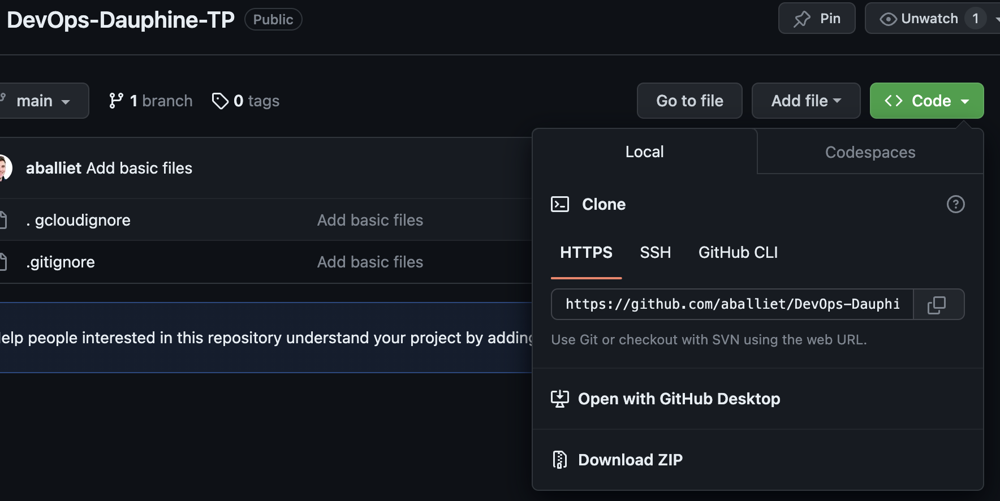
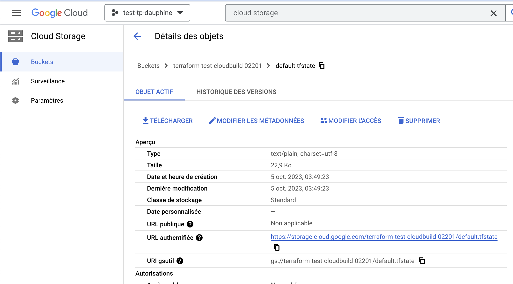

# Préparation du TP

## Préambule

Pour la réalisation de ce TP, vous utiliserez Cloud Shell et GitHub comme pour les sessions de cours précédentes.

## 1. Forker / Copier le repo sur votre compte GitHub

Vous utiliserez ce repo : https://github.com/aballiet/DevOps-Dauphine-TP comme base. Créez un "fork" / une copie de ce repo sur **VOTRE** compte GitHub (afin de pouvoir faire des commits)

## 2. Cloner VOTRE copie du repo

Clonez le avec `git clone` depuis Cloud Shell et tentez un commit pour vérifier que tout fonctionne !

## 3. Créer la base de données MySQL sur votre projet GCP

Dans le terminal de Cloud Shell, faites la commande :

```bash
gcloud alpha sql instances create main-instance --database-version=MYSQL_8_0_31 --cpu=2 --memory=8GiB --zone=us-central1-a --root-password=password123
```

Vous devriez avoir la résultat :
```bash
Creating Cloud SQL instance for MYSQL_8_0_31...working
```

Puis au bout d'un moment :

```bash
Creating Cloud SQL instance for MYSQL_8_0_31...done.
Created [https://sqladmin.googleapis.com/sql/v1beta4/projects/test-tp-dauphine/instances/main-instance].
NAME: main-instance
DATABASE_VERSION: MYSQL_8_0_31
LOCATION: us-central1-a
TIER: db-custom-2-8192
PRIMARY_ADDRESS: 104.154.20.193 # l'IP sera différente pour vous
PRIVATE_ADDRESS: -
STATUS: RUNNABLE
```

Vous êtes prêt.e pour le TP 🔥

## 3. Conseils
- Commentez vos fichiers et faites en sorte qu'ils soient faciles à lire
- Pour répondre aux questions : éditer le fichier TP.md de votre repo ou utilisez Google docs (mettre le fichier PDF exporté dans l'email de rendu) détaillant votre démarche. Même si vous êtes bloqués, cela permet de mettre en avant votre compréhension générale.
- Bien lire les messages d'erreur, dans la grande majorité des cas ils sont assez explicites pour que vous trouviez la cause
- Vous pouvez évidemment chercher de la documentation en ligne

## 4. ⚠️ Rendu du travail ⚠️
**Pour le rendu** : Envoyez moi par mail au plus tard à 11h45 à l'adresse antoine.balliet@dauphine.psl.eu votre dossier compressé ZIP contenant le code de VOTRE repo GitHub.

Cliquer sur **"Download ZIP"** en allant sur votre copie du dépôt.



**Joindre également son state terraform**



☝️ **BIEN VERIFIER LE CONTENU DU FICHIER ZIP AVANT DE RENDRE VOTRE TRAVAIL 🧘‍♂️**
